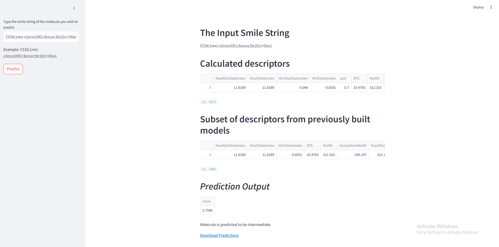

#🧪 Bioactivity of Drug Candidates 🧪

#💡 This project aims to predict whether a chemical compound is bioactive or not against a given enzyme 💡
##Users can input a SMILE of a chosen molecule and the -log(IC50) value is returned with indication whether it will be inactive, intermediate or active against Acetylcholinesterase.

##To run the app, clone the repository and open folder 'App' and find file 'App.py'. The run command 'streamlit run App\App.py'. A browser tab will open where you can input a SMILE ##and return predictions which can be downloaded.

###If you wish to follow through the notebooks or try it with a different target then run through the notebooks in the following order:

- Data_Collection/Chemical_Solubility.ipynb (This notebook calls for data from cheMBL and arranges it in a df)
- dd/Data_Analysis.ipynb (This notebook goes through descriptors and data preprocessing)
- Models/ (all three notebooks show different models)
- App/App.ipynb (This notebook pickles the chosen model for the app)
- run App.py

#Requirements

- Python
- Pandas
- Numpy
- Seaborn
- Scipy
- rdkit
- matplotlib
- sklearn
- xgboost
- lazyregressor
